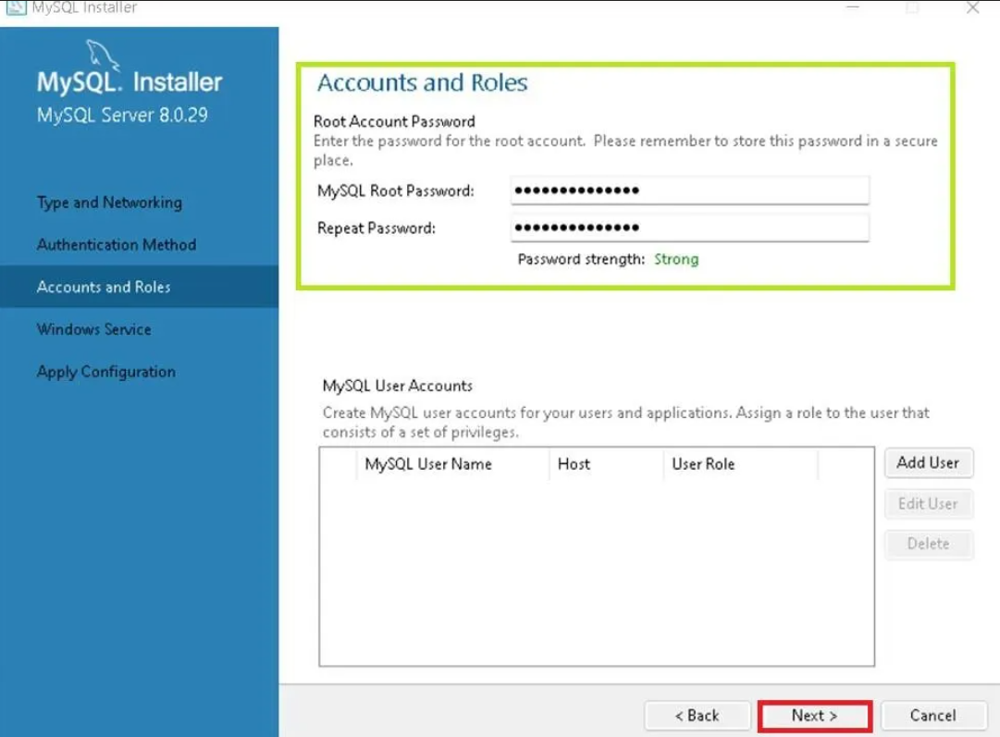
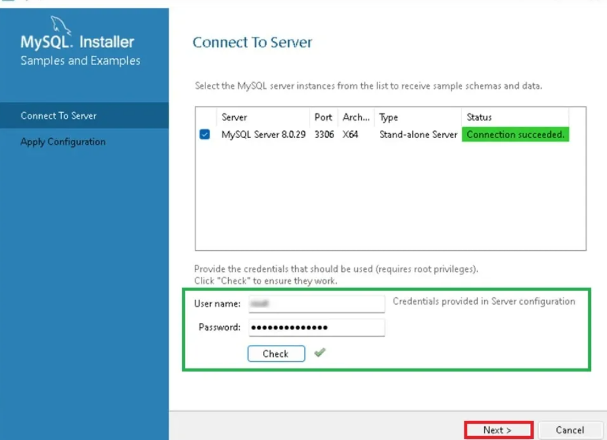
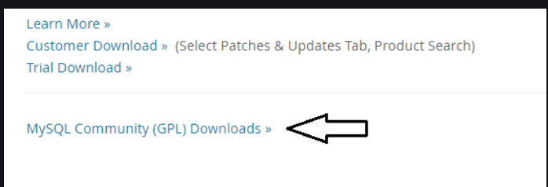
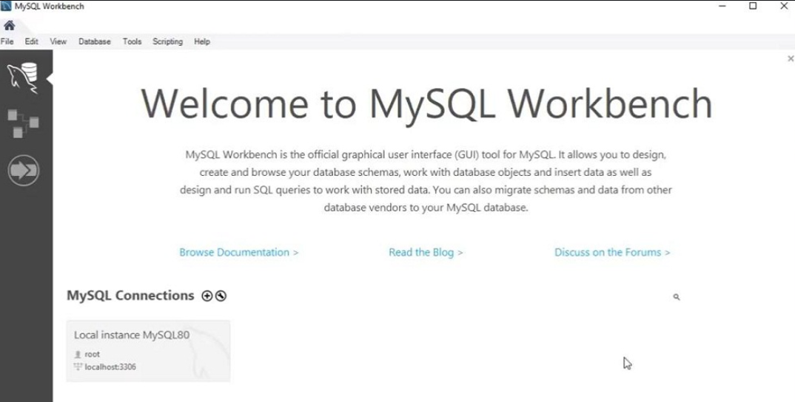

# Phần 1: Database
1. Cài đặt DBMS (tập trung vào MySQL và cài đặt Local)
- MySQL, SQL Server
- Có thể cài đặt online hoặc local(Workbench, XAMPP, AMPPS, Supabase, Docker Container,...)

Các bước cài đặt MySQL  
a. Đầu tiên, cần phải tải MySQL về máy (Windows)
- Bước 1: truy cập trang web chính thức của MySQL và chọn phiên bản, ấn Download

- Bước 2: Chọn cài đặt cho phiên bản MySQL của mình, cuối cùng tạo tài khoản, kết nối tới server và hoàn thành việc cài đặt (bấm Finish)
  
  
- [Nguồn tham khảo hướng dẫn việc cài đặt MySQl](https://www.geeksforgeeks.org/mysql/how-to-install-mysql-in-windows/)

Các bước cài đặt MySQL Workbench
- MySQL Workbench là 1 "unified visual tool" (1 cái tool hữu hình thống nhất), giúp người dùng có thể thao tác trực quan dễ dàng hơn trong việc thiết kế, quản lý CSDL.
- Sau khi đã cài đặt MySQL, bây giờ ta sẽ cài đặt MySQL Workbench
    - Bước 1: Truy cập vào trang chủ chính thức của MySQL, lướt xuống cuối trang ấn chọn MySQL Community (GPL) Downloads  
      
    - Bước 2: Khi trang download MySQL Workbench hiện ra, chọn MySQL Installer for Windows.
    - Bước 3: Bắt đầu cài đặt theo hướng dẫn xuyên suốt quá trình setup
    - Bước 4: Sau khi đã cài đặt xong, MySQL Workbench sẽ tự động chạy và hiện ra, điều đó nghĩa là bạn cài đặt thành công.  
    
- [Link tham khảo cài đặt MySQL WorkBench](https://www.geeksforgeeks.org/installation-guide/how-to-install-sql-workbench-for-mysql-on-windows/)

2. Các câu lệnh cơ bản với SQL
- Sau khi cài đặt thì tạo 1 CSDL cho 1 bài toán để thực hành(quản lý giải đấu, quản lý thư viện,...)  
a. Thao tác Dữ liệu (DML): SELECT, INSERT, UPDATE, DELETE

|Câu lệnh|Chức năng|Ví dụ|
|:---|:---|:---|
|`SELECT`|Truy vấn/Chọn dữ liệu. Dùng để lấy dữ liệu từ một hoặc nhiều bảng.|`SELECT TenSanPham, Gia FROM SanPham WHERE SoLuongTon > 0;`|
|`INSERT`|Chèn/Thêm dữ liệu vào bảng|`INSERT INTO KhachHang (MaKH, TenKH) VALUES (101, 'Nguyen Van A');`|
|`UPDATE`|Cập nhật/Sửa dữ liệu. Dùng để thay đổi dữ liệu đã có trong một hoặc nhiều hàng của bảng.|`UPDATE SanPham SET Gia = 250000 WHERE MaSP = 'SP001';`|
|`DELETE`|Xóa dữ liệu. Dùng để loại bỏ một hoặc nhiều hàng dữ liệu khỏi bảng.|`DELETE FROM KhachHang WHERE TrangThai = 'TamNgung';`|

b. Định nghĩa Dữ liệu (DDL): CREATE TABLE, DROP TABLE, ALTER TABLE, CREATE VIEW(tham khảo thêm), DROP VIEW(tham khảo thêm)  

|Câu lệnh|Chức năng|Ví dụ|
|:---|:---|:---|
|`CREATE TABLE`|Tạo bảng mới|`CREATE TABLE SinhVien (MaSV INT, TenSV VARCHAR(50));`|
|`DROP TABLE`|Xóa bảng|`DROP TABLE SinhVien;`|
|`ALTER TABLE`|Thay đổi cấu trúc bảng|`ALTER TABLE SinhVien ADD NgaySinh DATE;`|
|`CREATE VIEW`|Tạo view|`CREATE VIEW SV_Tre AS SELECT * FROM SinhVien WHERE YEAR(NgaySinh) > 2000;`|
|`DROP VIEW`|Xóa view|`DROP VIEW SV_Tre;`|
c. Trigger, Transaction: CREATE PROCEDURE, CREATE FUNCTION, CREATE TRIGGER, COMMIT, ROLLBACK, SAVE TRANSACTION  

|Câu lệnh|Chức năng|Ví dụ|
|:---|:---|:---|
|`CREATE PROCEDURE`|Tạo thủ tục lưu|`CREATE PROCEDURE GetSV AS SELECT * FROM SinhVien;`|
|`CREATE FUNCTION`|Tạo hàm trả về giá trị|`CREATE FUNCTION Tong(a INT, b INT) RETURNS INT RETURN a+b;`|
|`CREATE TRIGGER`|Tạo trigger tự động|`CREATE TRIGGER TG_AfterInsert AFTER INSERT ON SinhVien FOR EACH ROW BEGIN ... END;`|
|`COMMIT`|Ghi nhận thay đổi|`COMMIT;`|
|`ROLLBACK`|Hoàn tác thay đổi|`ROLLBACK;`|
|`SAVE TRANSACTION`|Đánh dấu điểm lưu|`SAVE TRANSACTION Save1;`|
d. Điều khiển Truy cập: GRANT, REVOKE  

|Câu lệnh|Chức năng|Ví dụ|
|:---|:---|:---|
|`GRANT`|Cấp quyền|`GRANT SELECT ON SinhVien TO user1;`|
|`REVOKE`|Thu hồi quyền|`REVOKE SELECT ON SinhVien FROM user1;`|
e. Toán tử truy vấn: FROM, WHERE, ORDER BY, HAVING, AND, OR,...

|Toán tử|Chức năng|Ví dụ|
|:---|:---|:---|
|`FROM`|Chỉ định bảng|`SELECT * FROM SinhVien;`|
|`WHERE`|Điều kiện lọc|`SELECT * FROM SinhVien WHERE MaSV > 100;`|
|`ORDER BY`|Sắp xếp kết quả|`SELECT * FROM SinhVien ORDER BY TenSV ASC;`|
|`HAVING`|Điều kiện cho nhóm|`SELECT Lop, COUNT(*) FROM SinhVien GROUP BY Lop HAVING COUNT(*) > 10;`|
|`AND`|Kết hợp điều kiện|`SELECT * FROM SinhVien WHERE MaSV > 100 AND TenSV LIKE 'Nguyen%';`|
|`OR`|Kết hợp điều kiện|`SELECT * FROM SinhVien WHERE MaSV < 50 OR TenSV LIKE 'Tran%';`|

### Lưu ý: Hiểu rõ hơn về GROUP BY, phân biệt giữa HAVING và WHERE
- `GROUP BY`: đơn giản là nhóm dữ liệu. Chúng nhóm lại những hàng mà có cùng giá trị trong 1 hoặc nhiều cột.
- `HAVING`: dùng để lọc nhóm dữ liệu (nên `HAVING` buộc phải đi kèm với `GROUP BY`).  
`HAVING` sử dụng các hàm tổng hợp: `SUM()`, `COUNT()`, `AVG()` -> `HAVING` thường được sử dụng với `GROUP BY` khi muốn lọc theo nhiều cột (1 cột cũng được)  
`HAVING` được xử lý sau `GROUP BY` 
- `WHERE`: dùng để lọc dữ liệu theo 1 cột.  
`GROUP BY` có thể đi với `WHERE` khi mà chỉ lọc theo 1 cột.  
`WHERE` được xử lý trước `GROUP BY`

# Phần 2: OOP (Khá dài, nên sẽ có 1 file README.md riêng cho OOP)
3. OOP trong Java 
a. Java cơ bản (object, class, abstract class, interface, biến, hàm, I/O, vòng lặp, thao tác file)  
b. 4 tính chất của OOP

------
4. Dependency Injection(DI), Inversion of Control(Ioc) 
- Khái niệm, ví dụ? (implement DI/IoC có thể bằng Java, C#,...)
- Tìm hiểu thêm: Ứng dụng DI, IoC trong Spring

**Note: Link báo cáo OOP**: [Tìm hiểu về OOP](OOP.md)